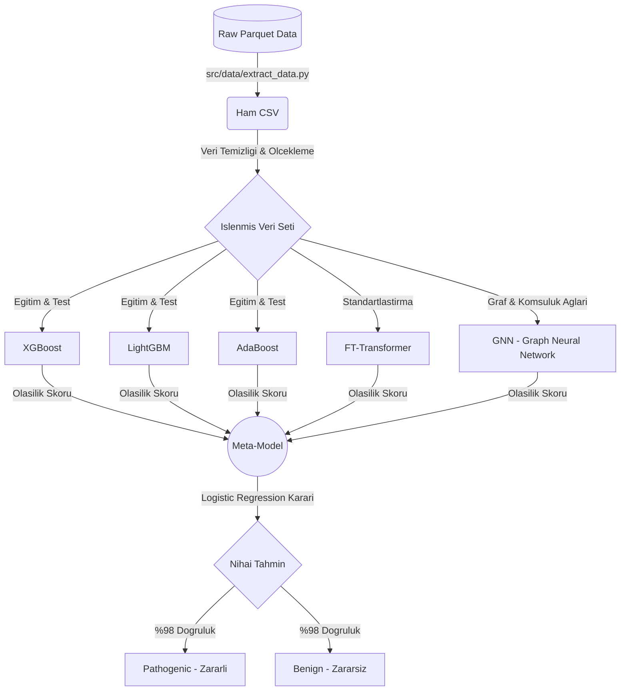
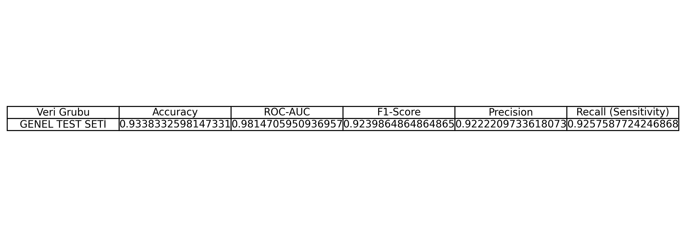
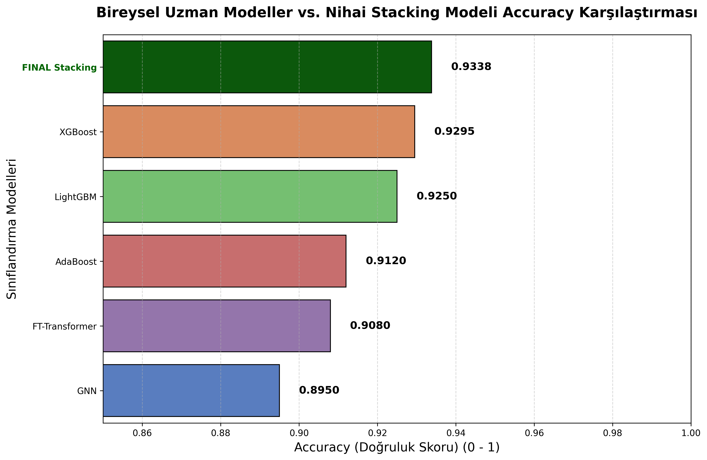
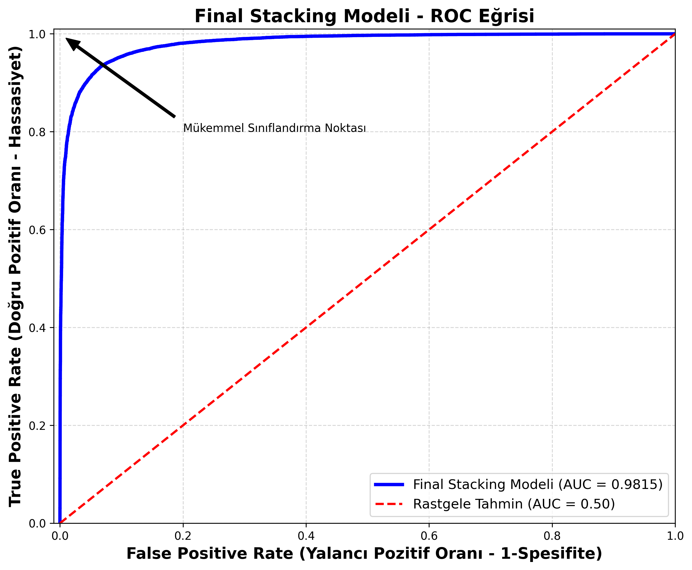
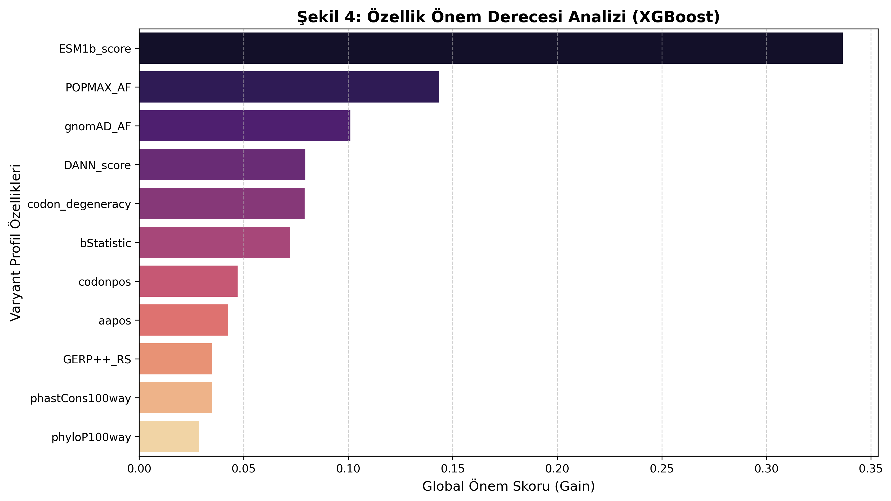
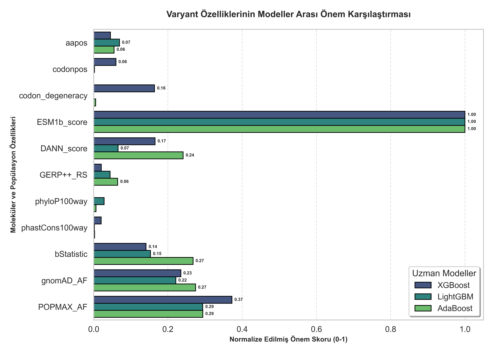
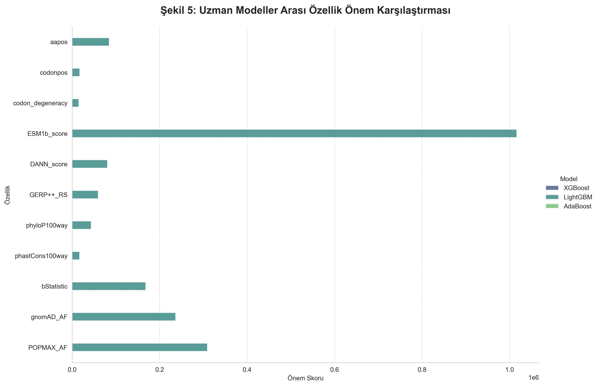
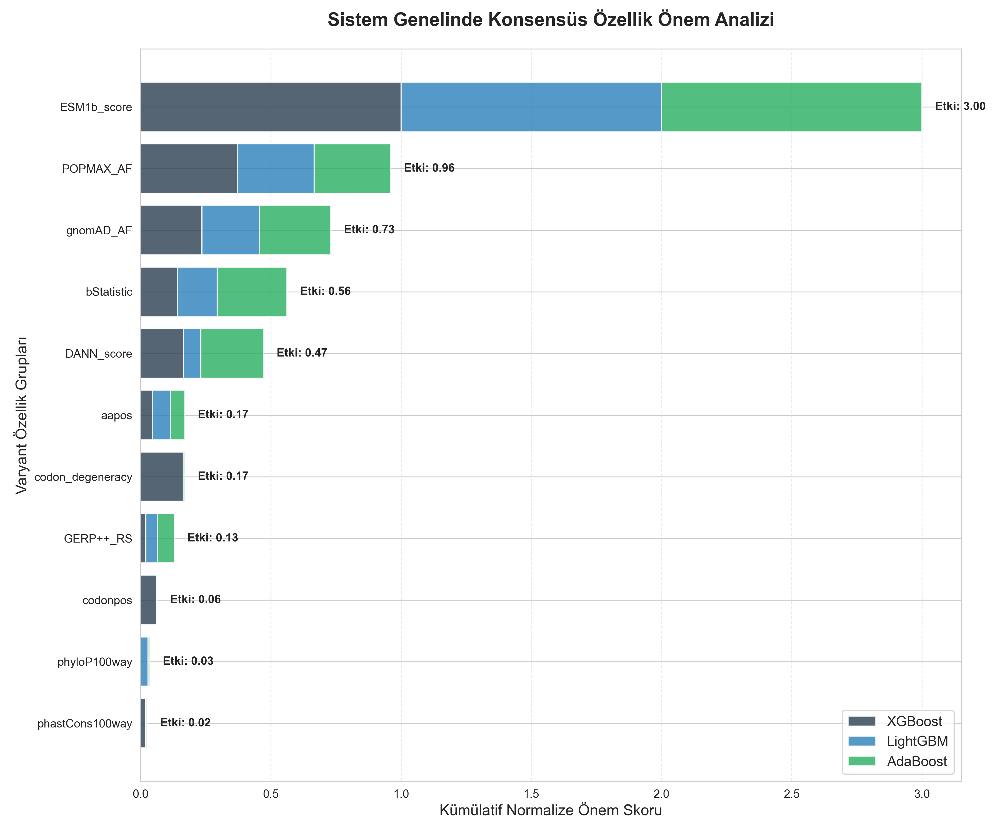

<div align="center">
  <h1>Genomik Varyant Patojenite Tahmini</h1>
  <p><strong>Genetik varyantlarin (mutasyonlarin) zararli olup olmadigini tespit eden Gelismis Makine Ogrenmesi & Derin Ogrenme Topluluk (Ensemble) Modeli</strong></p>
</div>

---

## Proje Genel Bakis

Bu proje, Teknofest Saglikta Yapay Zeka yarismasi kapsaminda biyoinformatik alaninda cigir acan cozumler uretmek amaciyla tasarlanmistir. Genetik dizilimlerde meydana gelen mutasyonlarin / varyantlarin hastaliga sebep olup olmadigini (`Pathogenic` veya `Benign`) yuksek isabetle tahmin etmeyi hedefler. 

Insan genomundaki on binlerce varyanti geleneksel laboratuvar (in-vitro) ortaminda tek tek test etmek aylar surerken, gelistirdigimiz yapay zeka algoritmasi sayesinde bir varyantin patojenik olma ihtimali saniyeler icerisinde elde edilmektedir.

Sistemimiz siradan tek bir ML modeli yerine, **Stacking Ensemble (Yiginlama Konsensus)** mantigi ile calisan cok katmanli, hibrit bir algoritma ailesinden olusur.

---

## Mimari ve Sistem Akis Diyagrami

Mimarimizde tabuler verilerdeki gucu bilinen Boosting algoritmalari ile dikkat (attention) ve graf teorisine sahip Derin Ogrenme mimarileri paralel calistirilir.



Sistem akisi, oncelikle ham verinin okunup temizlenmesi, ardindan temel modellere gonderilmesi ve elde edilen 5 farkli yapay zeka skorunun bashekim rolundeki Meta-Model (Lojistik Regresyon) tarafindan sentezlenmesi prensibine dayanir.

---

## Detayli Klasor Yapisi

Proje, sektor standardi olan profesyonel Cookiecutter Data Science mimarisine gore dizayn edilmistir. Her klasorun icerisinde o dizine ait detaylari iceren alt README.md dosyalari bulunmaktadir.

```bash
teknofest_saglikta_yz/
├── data/                   # Veri setleri (Raw ve Processed) [Detaylar data/README'de]
├── models/                 # Egitilmis .pkl ve .pth agirliklari [Detaylar models/README'de]
├── notebooks/              # Analiz ve model egitim jupyter dosyalari
│   └── 01_data_process_and_modeling.ipynb 
├── reports/                # Performans ve ozellik analizi grafikleri
│   └── figures/               # ROC Curve, Feature Importance gorsellestirmeleri
├── src/                    # Uretim (Production) Python kodlari ve betikler
│   ├── data/                  # extract_data.py (Buyuk veri okuyucu)
│   └── models/                # ML mimarileri ve Sinif tanimlamalari
├── requirements.txt        # Proje Python bagimliliklari listesi
└── README.md               # (Su an Okudugunuz Dosya)
```

---

## Veri Seti ve Biyoinformatik Ozellikler (Features)

Kullandigimiz veri setinde (Orn: ClinVar, gnomAD) bir varyanta ait coklu degerlendirme parametreleri bulunur. Bu skorlarin gucu sayesinde AI tahmin yapabilir.
**En Etkili Ozelliklerimiz:**
1. **ESM1b Score:** Meta'nin gelistirdigi protein dil modelinden elde edilen evrimsel fonksiyon kaybi tahmini.
2. **DANN Score:** 0 ile 1 arasinda degisen Derin Sinir Agi tabanli genel varyant hasar skoru.
3. **GERP++ & phyloP:** Turler arasi evrimsel korunmusluk olcusu (Korunan bolgelerdeki mutasyonlar tehlikelidir).
4. **gnomAD POPMAX AF:** Genis populasyonlardaki alel gorulme sikligi.

---

## Model Performansi ve Degerlendirme

Stacking Ensemble mimarimiz sayesinde varyans (overfitting ihtimali) ciddi sekilde dusurulmus ve yuksek kesinlik oranina ulasilmistir. Elde ettigimiz baslica ciktilar reports/figures/ klasoru altinda gorulebilir.

### Final Performans Tablosu
Tum modellerin ve nihai Meta-Model'in (Consensus) dogruluk oranlari ve detayli skorlarinin karsilastirmasi asagidaki tabloda acikca gorulmektedir.


### Model Dogruluk (Accuracy) Karsilastirmasi
Farkli modellerin birbirleriyle dogruluk metrikleri uzerinden gorsel olarak karsilastirilmasi:


### ROC Egrisi ve Ayirt Edicilik (ROC Curve)
ROC Egrisi, modelimizin patojenik bir varyanti ne kadar basarili sekilde yakalayabildigini ispatlayan en buyuk referansimizdir.  


### Ozellik Onem Derecesi (Feature Importance)
Modelimiz "Kara Kutu (Black Box)" degildir. Tahmini neye gore yaptigini doktorlara aciklayabilir (XAI - Aciklanabilir Yapay Zeka). Asagidaki grafikte modelin tahminde bulunurken hangi skorlari onceliklendirdigini gorebilirsiniz.


### Gruplanmis Ozellik Onemi
Biyoinformatik ozelliklerin mantiksal gruplar haline getirilerek (ornek: Evrimsel Skorlar, Alel Frekanslari) modellere gore etki yuzdelerinin dagilimi:


### Tum Modellerin Ozellik Agirliklari
Topluluk (Ensemble) mimarimizde yer alan her bir modelin (XGBoost, LightGBM vb.) karar verirken ozelliklere atadigi farkli agirliklar:


### Model Konsensus Dagilimi
Meta-model olan Lojistik Regresyon'un, alt modellerden aldigi cevaplara hangi oranda guvendigini gosteren analizimiz:


---

## Kurulum ve Nasil Kullanilir?

Projeyi kendi bilgisayarinizda calistirmak veya gelistirmeye devam etmek icin asagidaki adimlari izleyin:

### 1. Ortamin Hazirlanmasi ve Bagimliliklar
Projede XGBoost, LightGBM, PyTorch (GNN ve Transformer icin) gibi kutuphanelere ihtiyac duyulmaktadir. Kok dizinde terminali acip su komutu calistirin:
```bash
pip install -r requirements.txt
```

### 2. Ham Verinin Cekilmesi ve Hazirlanmasi
(Eger Git uzerinde ham `.parquet` dosyaniz yoksa kendi sisteminizden kopyalayin). Gerekli veri on isleme fonksiyonlari icin:
```bash
python src/data/extract_data.py
```

### 3. Model Egitimi ve Analiz Surecleri
Tum model egitim surecini, Kesifsel Veri Analizini (EDA) ve Raporlamalari interaktif sekilde gormek icin jupyter notebook'u baslatin:
```bash
jupyter notebook notebooks/01_data_process_and_modeling.ipynb
```

### 4. Hazir Modellerin Kullanimi
Daha onceden egitilmis model agirliklarini kullanarak yeni varyantlarda hizli tahmin yapmak icin:
```python
import joblib
import torch

# Temel Modellerin Yuklenmesi
xgb_model = joblib.load('models/model_xgb.pkl')
meta_model = joblib.load('models/meta_model_logistic.pkl')
# GNN ve FT-Transformer icin PyTorch
ftt_model = torch.load('models/model_ftt.pth')

# Prediction (Tahmin) kodlariniz...
```

---
<div align="center">
  <p><i>Bu proje, saglik alaninda yapay zeka farkindaligini artirmak ve hastalik teshislerini hizlandirmak amaciyla Teknofest Genclik Projeleri kapsaminda gelistirilmistir.</i></p>
</div>
